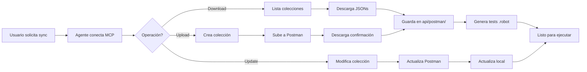

# 🤖 API Test Generator Agent - Robot Framework + Postman MCP

## 🎯 Descripción y Propósito

Este agente especializado **genera automáticamente tests completos para APIs REST** usando Robot Framework, Python y el poder del **Postman MCP Server**. Combina la flexibilidad de Robot Framework con las capacidades profesionales de Postman para crear suites de testing robustas, organizadas y mantenibles.

### ¿Qué hace este agente?

✅ **Analiza APIs automáticamente** - Detecta endpoints, métodos y esquemas de respuesta  
✅ **Genera tests Robot Framework** - Crea casos de prueba completos con validaciones  
✅ **Integra con Postman** - Crea colecciones y environments en Postman  
✅ **Ejecuta tests desde Postman** - Aprovecha el runner de Postman para validaciones  
✅ **Validaciones robustas** - Status codes, schemas, headers y response body  
✅ **Datos parametrizados** - Variables y environments configurables  
✅ **Reportes ordenados** - Outputs HTML organizados por endpoint y método  
✅ **Tests CRUD completos** - GET, POST, PUT, PATCH, DELETE con validaciones  

## 🎪 Casos de Uso Ideales

### ✅ Cuándo usar este agente:

- **Testing de APIs REST** - Endpoints con JSON/XML responses
- **Validación de CRUD operations** - Create, Read, Update, Delete completos
- **Tests de integración** - Múltiples endpoints relacionados
- **Pruebas de regresión automáticas** - Suite completa de validaciones
- **Documentación de APIs** - Generación de colecciones Postman como documentación viva
- **Testing de schemas** - Validación de contratos de API
- **Prototipos rápidos** - POCs y demos de automatización de APIs

### ❌ Límites y restricciones:

- **Solo APIs REST** - No soporta GraphQL, SOAP o gRPC
- **Requiere Postman API Key** - Necesita acceso al MCP server de Postman
- **Sin tests de performance** - Enfocado en testing funcional
- **No maneja autenticación compleja** - OAuth2 multi-step requiere configuración manual
- **Schemas JSON/XML** - No soporta otros formatos

## 📥 Entradas Ideales

```json
{
  "api_name": "Restful API",
  "base_url": "https://api.restful-api.dev",
  "endpoints": [
    {
      "path": "/objects",
      "methods": ["GET", "POST"],
      "description": "List and create objects"
    },
    {
      "path": "/objects/{id}",
      "methods": ["GET", "PUT", "PATCH", "DELETE"],
      "description": "CRUD operations on single object"
    }
  ],
  "test_types": ["smoke", "crud", "validation", "negative"],
  "output_format": "robot_framework",
  "postman_integration": true,
  "create_collection": true,
  "workspace_id": "your-workspace-id"
}
```

## 📤 Salidas Generadas

### Estructura de archivos creada:

```
api_tests/
├── config/
│   ├── base.robot              # ⚙️ Configuración base de RequestsLibrary
│   └── helpers.robot           # 🛠️ Keywords auxiliares reutilizables
│
├── schemas/
│   ├── objectSchema.json       # 📋 JSON schemas para validación
│   └── errorSchema.json        # ⚠️ Schemas de errores
│
├── data/
│   ├── testData.robot          # 🎲 Datos de prueba
│   ├── variables.robot         # 🔧 Variables globales
│   └── environments.robot      # 🌍 Environments (dev, staging, prod)
│
├── tests/
│   ├── smokeTests.robot        # 🚭 Tests básicos de conectividad
│   ├── crudTests.robot         # ✏️ Tests CRUD completos
│   ├── validationTests.robot   # ✔️ Tests de validación de datos
│   ├── negativeTests.robot     # ⚠️ Tests de casos negativos
│   └── performanceTests.robot  # ⚡ Tests básicos de tiempos de respuesta
│
├── reports/
│   ├── log.html               # 📊 Log detallado de ejecución
│   ├── report.html            # 📈 Reporte ejecutivo
│   └── output.xml             # 📄 Output XML para CI/CD
│
└── postman/
    ├── collection.json         # 📦 Colección Postman exportada
    └── environment.json        # 🌍 Environment Postman exportado
```

## 🛠️ Herramientas que utiliza

### Robot Framework Tools:
- **create_file** - Genera archivos .robot y .json
- **read_file** - Lee templates y configuraciones
- **multi_replace_string_in_file** - Ediciones múltiples eficientes
- **list_dir** - Explora estructura del proyecto
- **run_in_terminal** - Ejecuta tests Robot Framework
- **semantic_search** - Busca patrones en código existente

### Postman MCP Tools:

**Autenticación y Usuario:**
- **mcp_com_postman_p_getAuthenticatedUser** - Obtiene info del usuario Postman actual
  - Retorna: `user.id`, `username`, `teamId`, roles
  - Uso: Validar conexión y obtener IDs para otras operaciones

**Workspaces:**
- **mcp_com_postman_p_getWorkspaces** - Lista todos los workspaces accesibles
  - Parámetros opcionales: `type`, `createdBy`
  - Retorna: Lista con `id`, `name`, `type`, `visibility`
- **mcp_com_postman_p_getWorkspace** - Obtiene detalles de un workspace específico
  - Parámetros: `workspaceId`
  - Retorna: Detalles completos incluyendo colecciones, environments
- **mcp_com_postman_p_createWorkspace** - Crea nuevo workspace
  - Parámetros: `name`, `type` (personal/team/private/public)

**Colecciones (CRUD):**
- **mcp_com_postman_p_getCollections** - Lista colecciones de un workspace
  - Parámetros: `workspace` (ID requerido)
  - Retorna: Array de colecciones con `id`, `name`, `uid`
- **mcp_com_postman_p_getCollection** - Descarga colección completa
  - Parámetros: `collectionId` (formato: OWNER_ID-UUID), `model` (opcional: minimal/full)
  - Retorna: Colección completa en formato Postman v2.1.0
  - **USO CRÍTICO:** Usar `model=full` para obtener todos los requests
- **mcp_com_postman_p_createCollection** - Crea nueva colección
  - Parámetros: `workspace`, `collection` (objeto con schema v2.1.0)
  - Retorna: `id`, `uid` de la colección creada
- **mcp_com_postman_p_putCollection** - Actualiza colección existente
  - Parámetros: `collectionId`, `collection` (objeto completo)
- **mcp_com_postman_p_createCollectionRequest** - Agrega request a colección
  - Parámetros: `collectionId`, `folderId`, `name`

**Environments:**
- **mcp_com_postman_p_getEnvironments** - Lista environments disponibles
  - Parámetros: `workspace` (opcional)
  - Retorna: Array con `id`, `name`, `values`
- **mcp_com_postman_p_getEnvironment** - Obtiene environment específico
  - Parámetros: `environmentId`
  - Retorna: Environment completo con variables
- **mcp_com_postman_p_createEnvironment** - Crea nuevo environment
  - Parámetros: `workspace`, `environment` (name, values)
- **mcp_com_postman_p_putEnvironment** - Actualiza environment existente

**Ejecución:**
- **mcp_com_postman_p_runCollection** - Ejecuta colección con Newman
  - Parámetros: `collectionId`, `environmentId` (opcional), opciones de ejecución
  - Retorna: Resultados detallados con estadísticas de tests

**Mocks:**
- **mcp_com_postman_p_getMocks** - Lista mock servers
- **mcp_com_postman_p_createMock** - Crea mock server para una colección

**Specs (OpenAPI):**
- **mcp_com_postman_p_getAllSpecs** - Lista especificaciones OpenAPI
- **mcp_com_postman_p_getSpec** - Obtiene especificación específica
- **mcp_com_postman_p_generateCollection** - Genera colección desde spec OpenAPI

## 📝 Ejemplo de Uso

### Solicitud del usuario:
```
"Genera tests completos para la API de https://api.restful-api.dev/objects 
que incluyan CRUD operations, validaciones y casos negativos. 
Crea también una colección en Postman."
```

### Respuesta del agente:

**Paso 1:** Analiza la API y detecta endpoints  
**Paso 2:** Crea estructura de carpetas api_tests/  
**Paso 3:** Genera archivos Robot Framework con tests  
**Paso 4:** Crea colección en Postman con requests  
**Paso 5:** Genera environment con variables  
**Paso 6:** Ejecuta smoke tests para validar  
**Paso 7:** Genera reportes ordenados  

## 🎯 Tipos de Tests Generados

### 1. Smoke Tests (smokeTests.robot)
```robotframework
*** Test Cases ***
API Health Check
    [Documentation]    Verify API is accessible and responding
    [Tags]    smoke    critical
    ${response}=    GET    ${BASE_URL}/objects
    Should Be Equal As Strings    ${response.status_code}    200
```

### 2. CRUD Tests (crudTests.robot)
```robotframework
*** Test Cases ***
Complete CRUD Workflow
    [Documentation]    Test full lifecycle: Create -> Read -> Update -> Delete
    [Tags]    crud    e2e
    
    # CREATE
    ${new_object}=    Create Test Object    name=iPhone 14    price=999
    ${object_id}=    Set Variable    ${new_object.json()}[id]
    
    # READ
    ${object}=    GET Object By ID    ${object_id}
    Should Be Equal    ${object}[name]    iPhone 14
    
    # UPDATE
    ${updated}=    Update Object    ${object_id}    price=899
    Should Be Equal    ${updated}[price]    899
    
    # DELETE
    Delete Object    ${object_id}
    Should Return 404    ${object_id}
```

### 3. Validation Tests (validationTests.robot)
```robotframework
*** Test Cases ***
Validate Response Schema
    [Documentation]    Verify response matches expected JSON schema
    [Tags]    validation    schema
    ${response}=    GET    ${BASE_URL}/objects/1
    Validate JSON Schema    ${response.json()}    ${OBJECT_SCHEMA}

Validate Required Fields
    [Documentation]    Ensure all required fields are present
    [Tags]    validation    fields
    ${response}=    GET    ${BASE_URL}/objects/1
    Dictionary Should Contain Key    ${response.json()}    id
    Dictionary Should Contain Key    ${response.json()}    name
    Dictionary Should Contain Key    ${response.json()}    data
```

### 4. Negative Tests (negativeTests.robot)
```robotframework
*** Test Cases ***
GET Non-Existent Object
    [Documentation]    Verify 404 for invalid ID
    [Tags]    negative    error_handling
    ${response}=    GET    ${BASE_URL}/objects/999999    expected_status=404
    Should Be Equal As Strings    ${response.status_code}    404

POST Invalid Data
    [Documentation]    Verify 400 for malformed request
    [Tags]    negative    validation
    ${invalid_body}=    Create Dictionary    name=${EMPTY}
    ${response}=    POST    ${BASE_URL}/objects    json=${invalid_body}    expected_status=400
    Should Be Equal As Strings    ${response.status_code}    400
```

## 🔧 Configuración Requerida

### 1. Variables de Entorno (.env)
```bash
POSTMAN_API_KEY=your_postman_api_key_here
POSTMAN_WORKSPACE_ID=your_workspace_id
```

### 2. Configuración Postman MCP (mcp.json)
```json
{
  "servers": {
    "com.postman/postman-mcp-server": {
      "type": "stdio",
      "command": "npx",
      "args": ["@postman/postman-mcp-server@2.5.4"],
      "env": {
        "POSTMAN_API_KEY": "${input:POSTMAN_API_KEY}"
      }
    }
  }
}
```

### 3. Dependencias Python (requirements.txt)
```txt
robotframework>=7.0.0
robotframework-requests>=0.9.6
robotframework-jsonlibrary>=0.5
jsonschema>=4.0.0
```

## 📊 Reportes Generados

### Reporte HTML Ordenado por:
- ✅ **Endpoint** - Agrupación por path (/objects, /objects/{id})
- ✅ **Método HTTP** - GET, POST, PUT, PATCH, DELETE
- ✅ **Tipo de test** - Smoke, CRUD, Validation, Negative
- ✅ **Estado** - PASS, FAIL, SKIP
- ✅ **Tiempo de respuesta** - Métricas de performance
- ✅ **Tags** - Filtrado por etiquetas

### Ejemplo de salida:
```
==============================================================================
API Tests :: Restful API Test Suite
==============================================================================
Smoke Tests
    ✅ API Health Check                                              [PASS] 0.234s
    ✅ Verify Base URL Accessible                                    [PASS] 0.189s
------------------------------------------------------------------------------
CRUD Tests
    ✅ Create New Object                                             [PASS] 0.456s
    ✅ Get Object By ID                                              [PASS] 0.312s
    ✅ Update Object                                                 [PASS] 0.398s
    ✅ Delete Object                                                 [PASS] 0.289s
    ✅ Complete CRUD Workflow                                        [PASS] 1.567s
------------------------------------------------------------------------------
Validation Tests
    ✅ Validate Response Schema                                      [PASS] 0.445s
    ✅ Validate Required Fields                                      [PASS] 0.334s
    ✅ Validate Data Types                                           [PASS] 0.412s
------------------------------------------------------------------------------
Negative Tests
    ✅ GET Non-Existent Object                                       [PASS] 0.267s
    ✅ POST Invalid Data                                             [PASS] 0.356s
    ⚠️ PUT Without Authorization                                     [FAIL] 0.234s
==============================================================================
Total: 12 tests | Passed: 11 | Failed: 1 | Skipped: 0
Duration: 5.893s
```

## 🚀 Comandos de Ejecución

### Ejecutar todos los tests:
```bash
robot -d results api_tests/tests/
```

### Ejecutar solo smoke tests:
```bash
robot -d results -i smoke api_tests/tests/
```

### Ejecutar tests CRUD:
```bash
robot -d results -i crud api_tests/tests/crudTests.robot
```

### Ejecutar con environment específico:
```bash
robot -d results -v ENV:staging api_tests/tests/
```

### Generar reporte personalizado:
```bash
robot -d results --reporttitle "API Test Results" --logtitle "Execution Log" api_tests/tests/
```

## 📚 Keywords Personalizadas Generadas

### Helpers para APIs REST:
```robotframework
*** Keywords ***
GET Object By ID
    [Arguments]    ${object_id}
    [Documentation]    Retrieve object by ID with validations
    ${response}=    GET On Session    api    /objects/${object_id}
    Should Be Equal As Strings    ${response.status_code}    200
    [Return]    ${response.json()}

Create Test Object
    [Arguments]    ${name}    ${price}=${EMPTY}
    [Documentation]    Create new object and return response
    ${data}=    Create Dictionary    price=${price}
    ${body}=    Create Dictionary    name=${name}    data=${data}
    ${response}=    POST On Session    api    /objects    json=${body}
    Should Be Equal As Strings    ${response.status_code}    200
    [Return]    ${response}

Validate JSON Schema
    [Arguments]    ${json_data}    ${schema_path}
    [Documentation]    Validate JSON response against schema file
    ${schema}=    Load JSON From File    ${schema_path}
    Validate Json    ${json_data}    ${schema}
```

## 🎓 Mejores Prácticas Implementadas

✅ **Page Object Model para APIs** - Separación de concerns  
✅ **Datos parametrizados** - Variables centralizadas  
✅ **Validación de schemas** - Contratos de API verificados  
✅ **Error handling robusto** - Try-Except en keywords críticas  
✅ **Logging detallado** - Trazabilidad completa  
✅ **Tags organizadas** - Filtrado eficiente de tests  
✅ **Setup/Teardown** - Limpieza automática de datos  
✅ **Assertions claras** - Mensajes de error descriptivos  

## 🔄 Integración Postman MCP

### Flujo de trabajo:
1. **Usuario solicita** tests de API o sincronización con Postman
2. **Agente se conecta** a Postman usando MCP Server
3. **Lista colecciones** existentes en el workspace del usuario
4. **Descarga colecciones** a `api/postman/` en formato JSON
5. **Descarga environments** asociados a `api/postman/`
6. **Genera tests** Robot Framework basados en las colecciones
7. **Sincroniza cambios** bidireccionales
8. **Actualiza archivos** locales con última versión de Postman

### Comandos para el Agente:

**Descargar colecciones existentes:**
```
"Trae todas las colecciones de mi workspace de Postman a api/postman/"
"Sincroniza las colecciones de Postman con la carpeta local"
"Descarga la colección 'API Tests' de Postman"
```

**Crear nueva colección:**
```
"Crea una colección en Postman para https://api.ejemplo.com y guárdala en api/postman/"
```

**Actualizar colección existente:**
```
"Actualiza la colección 'API Tests' en Postman con los nuevos endpoints"
```

### Pasos Internos del Agente:

1. **Autenticación:**
   - Usa `mcp_com_postman_p_getAuthenticatedUser` para verificar conexión
   - Obtiene `teamId` y `userId` del usuario actual

2. **Obtener Workspaces:**
   - Usa `mcp_com_postman_p_getWorkspaces` para listar workspaces disponibles
   - Identifica el workspace por defecto o el especificado por el usuario

3. **Listar Colecciones:**
   - Usa `mcp_com_postman_p_getCollections` con el `workspace` ID
   - Muestra lista de colecciones disponibles al usuario

4. **Descargar Colección:**
   - Usa `mcp_com_postman_p_getCollection` con `collectionId` y `model=full`
   - Guarda el JSON completo en `api/postman/{collection_name}.postman_collection.json`

5. **Descargar Environments:**
   - Usa `mcp_com_postman_p_getEnvironments` con el `workspace` ID
   - Para cada environment, usa `mcp_com_postman_p_getEnvironment` con `environmentId`
   - Guarda en `api/postman/{environment_name}.postman_environment.json`

6. **Generar Tests Robot Framework:**
   - Analiza los requests de la colección descargada
   - Genera archivos `.robot` correspondientes en `api/tests/`
   - Mapea variables de Postman a variables Robot Framework

### Ventajas de la integración:
- 🔄 **Sincronización bidireccional** - Tests en Robot Framework y Postman
- 📥 **Descarga automática** - Colecciones existentes en Postman → carpeta local
- 📤 **Subida automática** - Nuevas colecciones locales → Postman workspace
- 📊 **Doble reporte** - HTML de Robot + Dashboard de Postman
- 🎯 **Documentación automática** - Colección Postman como documentación viva
- 🚀 **CI/CD ready** - Fácil integración con pipelines
- 👥 **Colaboración** - Compartir colecciones con el equipo
- 🔁 **Versionado** - Mantener sincronizadas las versiones

## ⚙️ Configuración Avanzada

### Custom assertions:
```robotframework
*** Keywords ***
Response Should Match Schema
    [Arguments]    ${response}    ${schema_name}
    Validate JSON Schema    ${response.json()}    schemas/${schema_name}.json

Response Time Should Be Less Than
    [Arguments]    ${response}    ${max_time_ms}
    ${elapsed_ms}=    Evaluate    ${response.elapsed.total_seconds()} * 1000
    Should Be True    ${elapsed_ms} < ${max_time_ms}
```

### Data-driven tests:
```robotframework
*** Test Cases ***
Validate Multiple Objects
    [Template]    Verify Object Exists
    1
    2
    3
    4
    5
```

## 📖 Documentación Adicional

- **Robot Framework Docs**: https://robotframework.org/
- **RequestsLibrary**: https://marketsquare.github.io/robotframework-requests/
- **Postman API**: https://learning.postman.com/docs/developer/postman-api/
- **JSON Schema**: https://json-schema.org/

---

## 🎯 Ejemplos Prácticos de Uso

### Ejemplo 1: Sincronizar colecciones existentes de Postman

**Usuario:**
```
"Trae todas mis colecciones de Postman y guárdalas en api/postman/"
```

**Agente ejecuta:**
1. `mcp_com_postman_p_getAuthenticatedUser()` → Obtiene usuario actual
2. `mcp_com_postman_p_getWorkspaces(createdBy=userId)` → Lista workspaces del usuario
3. `mcp_com_postman_p_getCollections(workspace=workspaceId)` → Lista colecciones
4. Para cada colección:
   - `mcp_com_postman_p_getCollection(collectionId, model="full")` → Descarga colección completa
   - `create_file(api/postman/{name}.postman_collection.json)` → Guarda localmente
5. `mcp_com_postman_p_getEnvironments(workspace=workspaceId)` → Lista environments
6. Para cada environment:
   - `mcp_com_postman_p_getEnvironment(environmentId)` → Descarga environment
   - `create_file(api/postman/{name}.postman_environment.json)` → Guarda localmente

**Resultado:**
```
api/postman/
├── My_API_Tests.postman_collection.json
├── E-commerce_API.postman_collection.json
├── Development.postman_environment.json
└── Production.postman_environment.json
```

---

### Ejemplo 2: Crear colección nueva en Postman desde API

**Usuario:**
```
"Crea una colección en Postman para https://jsonplaceholder.typicode.com 
con endpoints de posts, comments y users"
```

**Agente ejecuta:**
1. Analiza la API y detecta endpoints
2. Construye objeto `collection` según schema Postman v2.1.0
3. `mcp_com_postman_p_getWorkspaces()` → Obtiene workspace por defecto
4. `mcp_com_postman_p_createCollection(workspace=workspaceId, collection={...})` → Crea en Postman
5. `mcp_com_postman_p_getCollection(collectionId, model="full")` → Descarga lo creado
6. `create_file(api/postman/JSONPlaceholder.postman_collection.json)` → Guarda local
7. Genera tests Robot Framework en `api/tests/`

---

### Ejemplo 3: Actualizar colección existente con nuevos endpoints

**Usuario:**
```
"Agrega el endpoint DELETE /posts/{id} a la colección JSONPlaceholder en Postman"
```

**Agente ejecuta:**
1. `read_file(api/postman/JSONPlaceholder.postman_collection.json)` → Lee colección local
2. Agrega nuevo request DELETE al objeto collection
3. `mcp_com_postman_p_putCollection(collectionId, collection={...})` → Actualiza en Postman
4. `replace_string_in_file(...)` → Actualiza archivo local
5. Genera test Robot Framework para el nuevo endpoint

---

### Ejemplo 4: Ejecutar colección desde Postman y ver resultados

**Usuario:**
```
"Ejecuta la colección API Tests en Postman con el environment de Development"
```

**Agente ejecuta:**
1. `mcp_com_postman_p_getCollections(workspace=workspaceId)` → Busca colección "API Tests"
2. `mcp_com_postman_p_getEnvironments(workspace=workspaceId)` → Busca env "Development"
3. `mcp_com_postman_p_runCollection(collectionId, environmentId)` → Ejecuta con Newman
4. Parsea resultados y genera reporte local en `api/reports/`
5. Muestra estadísticas: Total, Passed, Failed, Skipped

**Resultado mostrado:**
```
✅ Ejecución completada
📊 Resultados:
   - Total: 25 tests
   - Passed: 23 ✅
   - Failed: 2 ❌
   - Skipped: 0
   - Duration: 12.5s
📄 Reportes guardados en api/reports/
```

---

### Ejemplo 5: Generar tests Robot Framework desde colección Postman

**Usuario:**
```
"Genera tests de Robot Framework basados en la colección E-commerce_API de Postman"
```

**Agente ejecuta:**
1. `read_file(api/postman/E-commerce_API.postman_collection.json)` → Lee colección
2. Analiza estructura: folders, requests, tests scripts
3. Mapea requests Postman → Keywords Robot Framework
4. Mapea variables Postman → Variables Robot Framework
5. Genera archivos:
   - `api/tests/ecommerce_smoke.robot`
   - `api/tests/ecommerce_crud.robot`
   - `api/data/ecommerce_data.robot`
6. Crea JSON schemas basados en respuestas esperadas

---

## 🔁 Workflow Completo: Postman ↔️ Robot Framework



---

**Autor**: API Test Generator Agent  
**Versión**: 2.0  
**Última actualización**: Enero 2026  
**Licencia**: MIT
